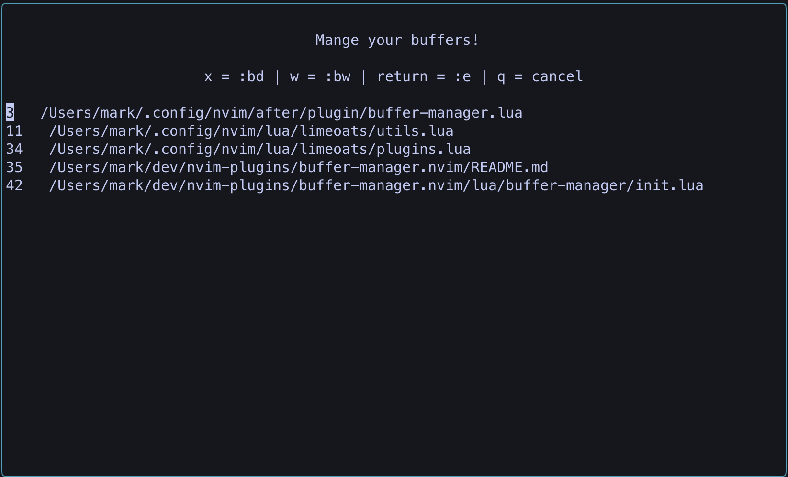

# buffer-manager.nvim

A simple buffer manager for Neovim



## Installation

Install with Packer:

```lua
use "Limeoats/buffer-manager.nvim"
```

or install with vim-plug:

```vim
Plug 'Limeoats/buffer-manager.nvim'
```

## Setup

```lua
local status, buffer_manager = pcall(require, "buffer-manager")
if not status then return end

buffer_manager.setup {
    -- defaults
    window_title = "Manage your buffers!",
    window_width = 90,
    window_height = 25,
    force_close = false,
    padding_left = 1,
    padding_right = 1,
    keys = {
        delete_key = 'x',
        wipe_key = 'w',
    }
}
```

## Keymap

You only need one keymapping to use this plugin. The rest of the keymaps are handled through the `keys` option.

`vim.keymap.set("n", "<leader>bb", "<cmd>BufferManagerShow<CR>")`

## Contributing

PRs are welcome! More information on submission guidelines coming soon.

## Issues

Please feel free to open an issue if you find any bugs or have feature suggestions.

## License

This project is under the [MIT License](https://github.com/Limeoats/buffer-manager.nvim/blob/master/LICENSE).

## Support

If you find this plugin helpful and would like to say thank you, feel free to click the button below and buy me a coffee!

<a href='https://ko-fi.com/Q5Q8FGABI' target='_blank'></a>

## Contact

Limeoats - [@Limeoats](https://twitter.com/limeoats) - oats@limeoats.com
